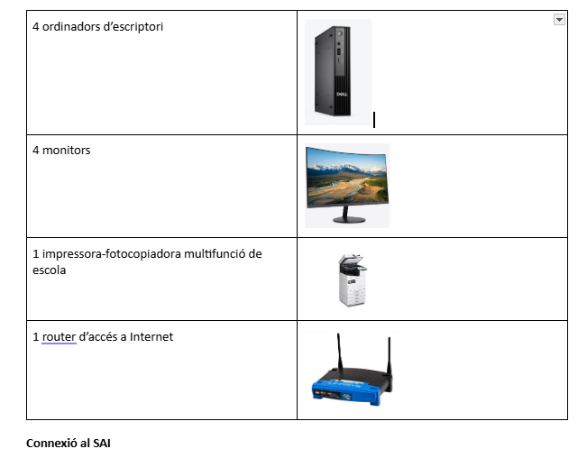

## Selecció d’un SAI per una empresa client

# 1. Inventari d’equips

La situació que tenim és un petit despatx amb 4 estacions de treball, 1 impressora-fotocopiadora multifunció i 1 router d’accés a Internet.

---

# 2. Connexió al SAI

- **Sí:** ordinadors, monitors i router  
- **No:** impressora multifunció  
  - **Motiu:** consum molt alt en imprimir (300 W), que reduiria l’autonomia i no és necessari protegir-la per dades.

### El que porta cadascun d’ells

**Ordinador d’escriptori:** Lenovo A100 AIO (24" Intel)  
- Watts: 65 W  
- VA: 65 W / 0,85 = 76,47 VA  

**Monitor:** Lenovo A100 AIO (24" Intel)  
- Watts: 65 W  
- VA: 65 W / 0,85 = 76,47 VA  

**Router:** TP-Link TL-MR100 Router Wi-Fi N 4G LTE  
- Enllaç: [PCComponentes](https://www.pccomponentes.com/tp-link-tl-mr100-router-wi-fi-n-4g-lte)  
- Watts: 9 W  
- VA: 9 W / 0,85 = 7,65 VA  

**Impressora multifunció:** Brother DCP-L3560CDW Multifunción Láser LED Color WiFi Dúplex  
- Enllaç: [PCComponentes](https://www.pccomponentes.com/brother-dcp-l3560cdw-multifuncion-laser-led-color-wifi-duplex)  
- Watts: 560 W  
- VA: 700 VA  

---

# 3. Càlcul de potència total

**Dispositius connectats al SAI:** 4 ordinadors + 4 monitors + 1 router  

### Total Watts
- 4 × 65 W (ordinadors) = 260 W  
- 4 × 65 W (monitors) = 260 W  
- Router = 9 W  
**Total = 260 + 260 + 9 = 529 W**

### Total VA
- 4 × 76,47 VA (ordinadors) = 305,88 VA  
- 4 × 76,47 VA (monitors) = 305,88 VA  
- Router = 10,59 VA  
**Total = 305,88 + 305,88 + 10,59 = 622,35 VA**

---

# 4. Determinació de l’autonomia

**Total consum:**  
4×65 W (ordinadors) + 4×65 W (monitors) + 9 W (router) = 529 W  

Incloent reserva del 20% → 529 × 1,2 ≈ 635 W  

L’objectiu és mantenir el sistema encès **durant 10 minuts (0,167 h)** per poder desar treballs i apagar els equips correctament.

Càlcul:
- 10 min = 10 / 60 = 0,167 h  
- Energia necessària = 635 W × 0,167 h = 106 Wh (aproximadament)  

Aquesta configuració proporcionaria **uns 13–14 minuts** d’autonomia amb els equips escollits.

---

# 5. Recerca de models de SAI

- [APC Easy UPS BVX2200LI-GR (2200VA / 1200W)](https://www.pccomponentes.com/apc-easy-ups-bvx2200li-gr-sai-2200va-1200w)  
- [Salicru SPS2000ONE V2](https://www.pccomponentes.com/salicru-sps2000one-v2)

- # 5. Recerca de models de SAI

| Model | Potència | Autonomia | Tipus de sortides | Preu | Marca |
|:------|:----------|:-----------|:------------------|:------|:------|
| [APC Easy UPS](https://www.pccomponentes.com/apc-easy-ups-bvx2200li-gr-sai-2200va-1200w) | 1200 W (2200 VA) | 16 minuts | AC Tipus F | 239 € | APC |
| [SAI Salicru SPS.2000.ONE V2](https://www.pccomponentes.com/salicru-sps2000one-v2) | 1200 W (2000 VA) | 20 minuts | 4 sortides AC | 209 € | SALICRU |

# Informe Tècnic – Càlculs i Selecció de SAI

## 1. Càlculs realitzats

**Suposicions:**
- Càrrega dels equips: **1000 W**  
- Potència del SAI: **1200 W**

**Càlcul d’autonomia:**

Autonomia nominal: 20 minuts  
Factor de càrrega aplicat: 1200 W / 1000 W = 1,2  

**Autonomia aproximada:**  
20 min × 1,2 = **24 minuts**

---

## 2. Models analitzats

**Característiques generals:**
- **Topologia:** Línia interactiva  
- **Potència:** 1200 W / 2000 VA  
- **Autonomia:** fins a 20 minuts  
- **Sortides:** 4 preses AC tipus F  
- **Bateria:** Plom-Calci (Pb-Ca)  
- **Regulació de tensió:** AVR Boost & Buck  
- **Monitorització:** Port USB amb software compatible amb Windows, Linux i altres sistemes operatius  

---

## 3. Justificació de la selecció final

El model seleccionat proporciona:
- **Autonomia suficient** per a càrregues habituals (fins a 24 minuts estimats).  
- **Protecció completa** davant sobretensions, sobrecàrregues i línies de dades, evitant la pèrdua de servei dels servidors.  
- **Monitorització remota**, gràcies a la connexió USB i compatibilitat amb múltiples plataformes.  
- **Fiabilitat i baix nivell de soroll**, ideals per a entorns d’oficina o escoles.

---

**Conclusió:**  
El SAI triat garanteix estabilitat elèctrica, seguretat per als equips i un bon control de l’estat del sistema, essent una opció equilibrada entre rendiment, autonomia i manteniment.

