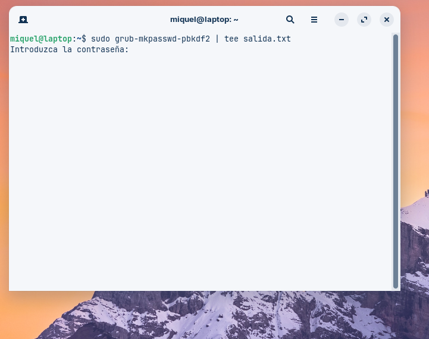
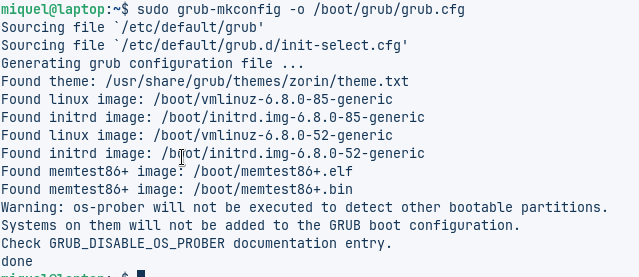

## GUIA DE SEGUIMENT DE LA MAQUINA VIRTUAL

# links info
https://geekland.eu/proteger-el-grub-con-contrasena/
https://www.jose-web.es/como-poner-contrasena-en-grub/

# Guia
1. Creació de la màquina virtual

Principalment crearem la màquina virtual amb la OVA dins la carpeta de seguretat que ens va donar en Carlos.

2. Configuració dels recursos

Seguidament haurem de posar 2 nuclis de CPU i 8 GB de RAM.

3. Accés al mode de recuperació

Aquesta màquina és Zorin. Entrarem a la boot amb la tecla de majúscules i accedirem al mode de recuperació, en el nostre cas perquè volem canviar la contrasenya.

4. Canvi de contrasenya

Tenim el menú de recuperació, fem clic a root per entrar i començarem a posar les ordres necessàries. Podrem veure quin és l’usuari de l’ordinador i canviarem la contrasenya. Primer pas fet, guardarem les opcions correctament i sortirem per entrar dins la màquina.

5. Accés amb la nova contrasenya

A continuació entrarem al compte de Miquel amb la nova contrasenya. Com veiem, ja estem dins.

6. Fortificació de la contrasenya

Ara el que volem és fortificar la contrasenya, per això volem obtenir la contrasenya hash i l’haurem de copiar dins l’arxiu, en aquest cas el 40_custom.

7. Modificació de l’arxiu 40_custom

Dins l’arxiu, entrant amb permisos de superusuari, posarem el superusuari i la contrasenya hash enganxada a la part final del document.

8. Guardar els canvis

Un cop feta la modificació, guardarem tot.

9. Afegir seguretat a la BIOS

Seguidament volem entrar de manera normal dins el sistema, però volem afegir més seguretat a la BIOS per posar més protecció.

10. Modificació de l’arxiu 10_linux

